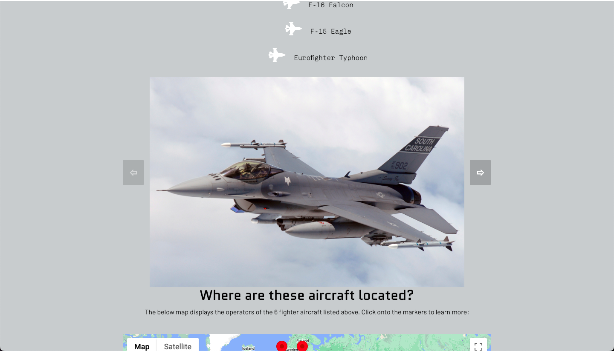
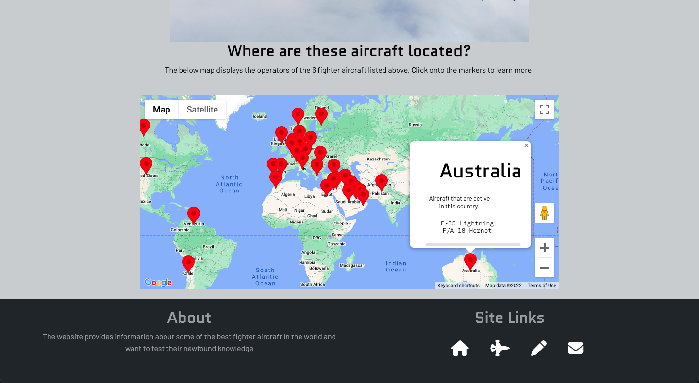
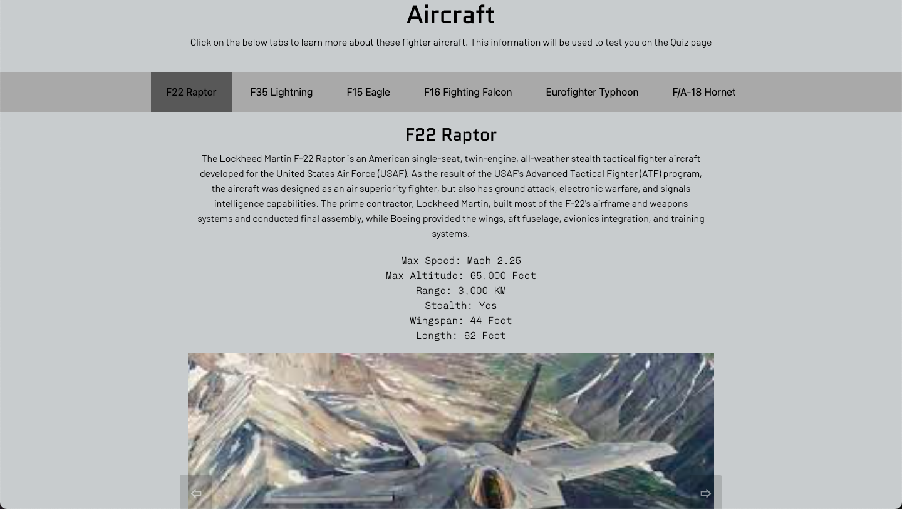
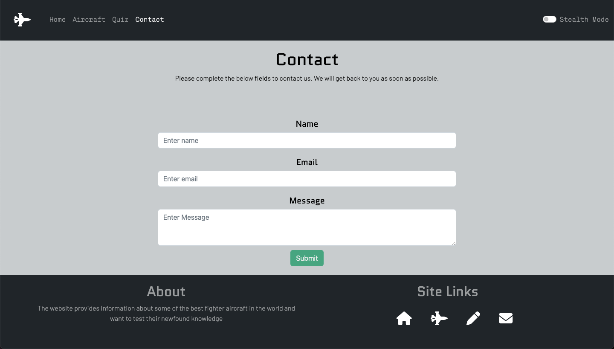
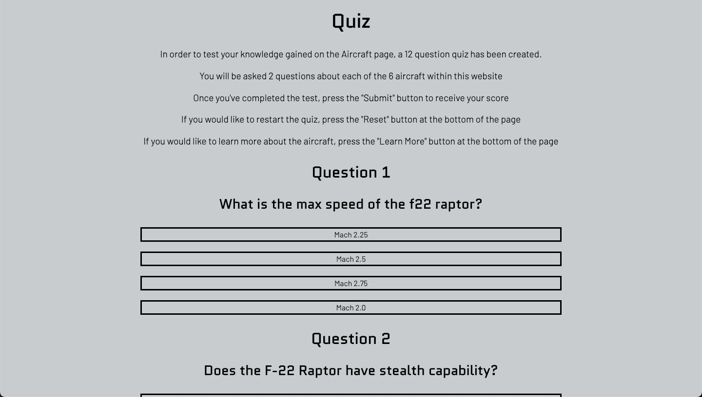
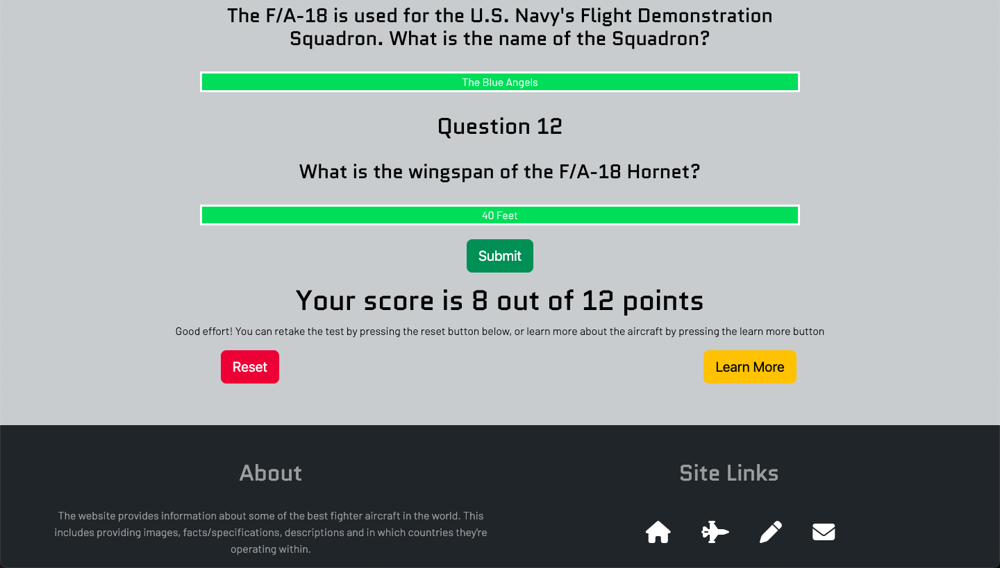
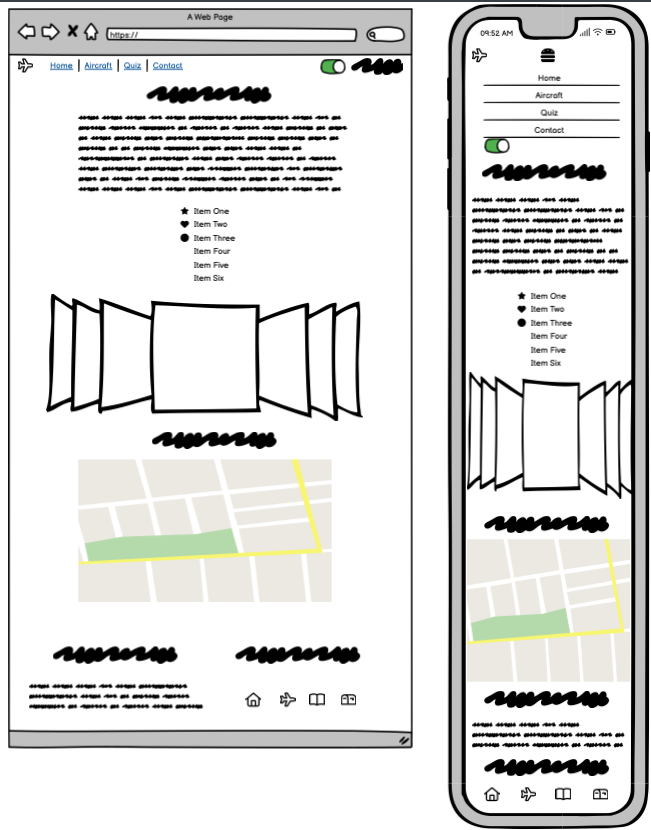
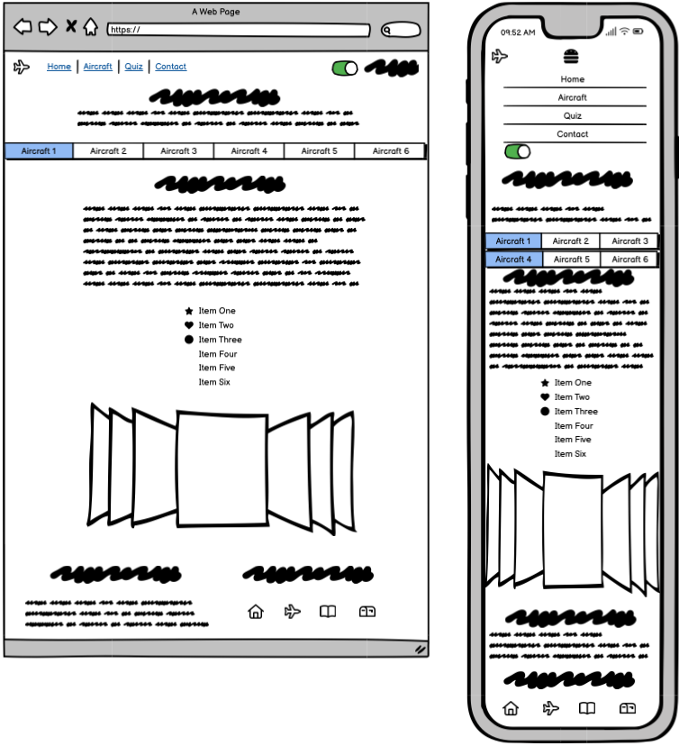
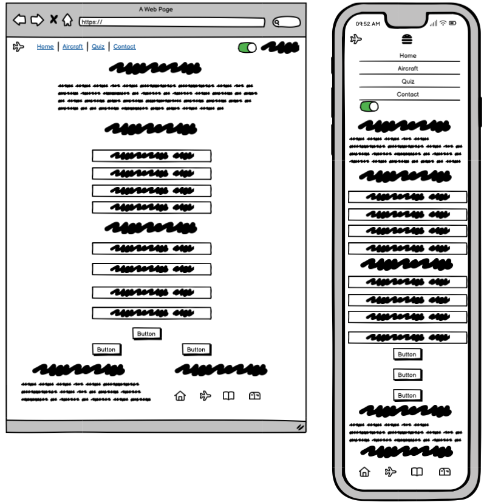
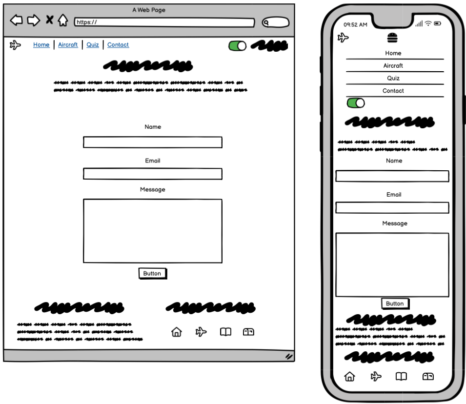

# Purpose
In this project, an interactive front-end site has been built. The site responds to the users' actions, allowing users to actively engage with data and alter the way the site displays the information to achieve their preferred goals.

The website provides information about some of the best fighter aircraft in the world. This includes providing images, facts/specifications, descriptions and in which countries they're operating within. 

With the information gathered about the fighter aircraft, the user is then able test their knowledge by completing a 12 question quiz.

The user is also able to get in touch with the administrators of the website via a contact form.

The target audience is anyone who wants to learn more about the best fighter aircraft in the world and want to test their newfound knowledge.

This website was made for the second of four milestone projects required to complete the diploma in software development program at The Code Institute.

[Click Here to View the Website!](https://alexzanotti.github.io/military_aircraft_milestone_project_2/)

# Value provided:
1. Users are able to interact with the site in their particular way, to achieve their personal goals and derive answers to their specific questions.
2. The site owner advances their own goals by providing this functionality, potentially by being a regular user themselves.
3. The website is responsively designed, to make for a pleasant user experience.
4. Value has been provided to satisfy the various user profiles/stories, as the website was structured around the user stories. For example, there is a user who wants to test their military aircraft knowledge, "I want to be able to test my newfound knowledge of the fighter aircraft". Value provided by the website to satisfy this user requirement is having a quiz page, where questions have been presented (derived from the "aircraft" page) and give feedback to the user once they've submitted their answer.

# Project Requirements
In order to pass this milstone project, the following requirements must be met:
1. Technologies Required: HTML, CSS, JavaScript
2. Optional Technologies: jQuery or any other JavaScript libraries, external APIs
3. Dynamic Front End Project: Write custom JavaScript, HTML and CSS code to create a front-end web application consisting of one or more HTML pages with significant interactive functionality
4. Site Responses: Use JavaScript to have the site produce relevant responses dependent on users' actions.
5. Information Architecture: Incorporate a main navigation menu (unless irrelevant) and structured layout (you might want to use Bootstrap to accomplish this).
6. Documentation: Write a README.md file for your project that explains what the project does and the value that it provides to its users.
7. Version Control: Use Git & GitHub for version control.
8. Attribution: Maintain clear separation between code written by you and code from external sources (e.g. libraries or tutorials). Attribute any code from external sources to its source via comments above the code and (for larger dependencies) in the README.
9. Deployment: Deploy the final version of your code to a hosting platform such as GitHub Pages.

# UX

## The ideal users for this website:
* Are military aircraft enthusiasts
* Are interested in learning more about fighter aircraft
* Want to test their military aircraft knowledge

## User Stories

### Military Aircraft Enthusiasts User Stories

* As a Military Aircraft Enthusiast, I want to see images of the best fighter aircraft in the world.
* As a Military Aircraft Enthusiast, I want to learn more about where the best fighter aircraft in the world are located.

### Users Interested in Learning More About Fighter Aircraft User Stories

* As a user interested in learning more about fighter aircraft, I want to have an understanding of the performance of the fighter aircraft, such as the top speed, maxiumum altitude etc.
* As a user interested in learning more about fighter aircraft, I want to be able to contact the websites "admin" team, in order to ask any further questions

### Users Who Want to Test Their Military Aircraft Knowledge User Stories

* As a user who wants to test their military aircraft knowledge, I want to be able to test my newfound knowledge of the fighter aircraft
* As a user who wants to test their military aircraft knowledge, I want to be able to receive feedback on how well i understand the information about the aircraft

## User Story Images 

### User Story 1
* As a Military Aircraft Enthusiast, I want to see images of the best fighter aircraft in the world.

### User Story 2
* As a Military Aircraft Enthusiast, I want to learn more about where the best fighter aircraft in the world are located.

### User Story 3
* As a user interested in learning more about fighter aircraft, I want to have an understanding of the performance of the fighter aircraft, such as the top speed, maxiumum altitude etc.

### User Story 4
* As a user interested in learning more about fighter aircraft, I want to be able to contact the websites "admin" team, in order to ask any further questions

### User Story 5
* As a user who wants to test their military aircraft knowledge, I want to be able to test my newfound knowledge of the fighter aircraft

### User Story 6
* As a user who wants to test their military aircraft knowledge, I want to be able to receive feedback on how well i understand the information about the aircraft

## Development Planes

### Strategy Plane
The strategy incorporates the user story needs. This website will focus on the following target audience, divided into three main categories:

* Are military aircraft enthusiasts
* Are interested in learning more about fighter aircraft
* Want to test their military aircraft knowledge

#### Personality
* Bright
* Thoughtful
* Diligent
* Persistent
* Rational

#### Demographic
* Age - 18-60
* Gender - Male
* Education - Some College

### Scope Plane
In scope for this project are the following requirements:

* Images of the best fighter aircraft in the world.
* Learn more about where the best fighter aircraft in the world are located.
* Learn more about the performance of the fighter aircraft, such as the top speed, maxiumum altitude etc.
* Be able to contact the admin of the site for any enquiries
* Test knowledge of the fighter aircraft
* Receive feedback on how well i understand the information about the fighter aircraft

### Structure Plane
The structure of the website will be as follows:
* Home Page
* Aircraft Page
* Quiz Page
* Contact Page

### Skeleton Plane
In order to complete the skeleton plane, wireframes were made using [Balsamiq](https://balsamiq.com/). 

### Balsamiq Wireframe Images
Below are the Wireframes created in Balsamiq for this project:
* Home Page Wireframe

* Aircraft Page Wireframe

* Quiz Page Wireframe

* Contact Page Wireframe

### Surface Plane

The surface of this website endevours to give a military ‘look-and-feel’, in terms of the following colours/graphics:

#### Colour Schemes

The main colours used through this project are as follows:

* Light Grey
* Dark Grey
* Red
* White
* Light Green
* Black

This fits the military theme, for example the stealth mode switch toggles a black background accompanied by a light green colour scheme. This replicates a fighter aircrafts heads up display (HUD).

#### Graphics

For each aircraft in scope of the website, an number of images have been provided.

Icons have have been used within the navigation bar, footer, browser icon and the lists on the home page.

# Features

## Head
- Each page of the website contains a relevant title
- A fighter aircraft browser icon image is used

## Header
- Bootstrap is used to construct the header
- Depending on what page the user is on, the color of the list item will be different
- When hovering over a different list item, the color will change
- A fighter aircraft icon is held on the left hand side of the navigation bar
- When hovering over the icon, the color changes to green
- Clicking on the icon takes the user to the home page
- A stealth mode toggle has been added to the navigation bar
- The stealth mode toggle changes the styling of the main content of the page
- For smaller screens, a vertical navbar (hamburger) is used

## Footer
- Bootstrap is used to contruct the footer
- The "About" information is held on the left hand side of the page (for larger screens)
- The "Site Links" information is held on the right hand side of the page (for larger screens)
- Icons are used to denote the site links
- The icons change color to green when hovering
- Clicking on the icons take the user to the relevant page
- For smaller screens, the about section is stacked about the site links

## Home Page

- The home page contains introductory text, describing the website
- The unordered list displays the aircraft in scope of the website
- The bullet points for the list are not displayed - fighter aircraft icons are used instead
- The aircraft icons change color to green when hovered over
- There is an image carousel that the user is also to select the "previous" or "next" icons to change image
- There is a Google Maps API that allows the user to view where each of the 

## Aircraft Page

- The introductory text advises the user to select a tab to view information about each aircraft
- The "select" div contains buttons for each of the 6 aircraft
- When clicking a button, the information around the aircraft is presented
- for each aircraft, there is a brief description, list of facts and image carousel

## Quiz Page

- The introductory text gives and overview of the quiz and how to submit/reset/learn more.
- There are 12 multiple choice questions presented
- When hovering over an answer, the color changes
- When selecting an answer, the user is given feedback on whether the answer was correct or incorrect
- The questions not selected for those answers are then no longer displayed
- The selected answer changes color, denoting whether the answer was correct or incorrect
- There is a "Submit" button that the user selects one completing the quiz
- Upon clicking the "Submit" button, the user receives their score (out of 12)
- The user is able to click the "Reset" button, which will refresh the page, enabling the user to start the quiz again
- The user is able to click the "Learn More" button, which will take the user to the "Aircraft" page

## Contact Page

- The contact page contains a form that the user is able to complete. It asked for their Name, Email and Message.
- The "Submit" button is disabled until the user completes all fields. The color of the "Submit" button will slightly change when this occurs

# Technologies Used

## Main Technologies Used
### HTML5
### CSS3
### Javascript

## Frameworks, Libraries & Programs Used
### Bootstrap
Bootstrap was used in the media page to assist with enabling a responsive design
### jQuery 
jQuery was sparingly used within the project
### Google Maps API
The Google Maps API was setup with markers set for each country that operates at least one of the aircraft within the site. 
### EmailJS
EmailJS is used to send the contact form through to the "admins" mailbox, so they can contact the user who raised the request
### Google Fonts
Google fonts was used to import the fonts Barlow, Chivo Mono, Lato, Oswald & Quantico into the style.css file.
### Font Awesome
Font Awesome was used on all pages in the header (fighter aircraft icon to link to home page) footer (to denote site links). The fighter aircraft icon was also used on the home page in place of bullet points for the unordered list
### GitPod
GitPod was used for writing code, commiting, and then pushing to GitHub.
### GitHub
GitHub was used as the repository for the code.
### Balsamiq
Balsamiq was used to create the wireframes during the design of the project.
### validator.w3.org
This was used to validate the HTML code
### jigsaw.w3.org/css-validator
This was used to validate the CSS code
### JSHint
This was used to validate the Javascript code

# Testing
Testing information can be found the the following [file](TESTING.md "Link to testing file")

# Deployment

This project was developed using [GitPod](https://www.gitpod.io/ "Link to GitPod site"), which was then committed and pushed to GitHub using the GitPod terminal.

## Deploying on GitHub Pages
To deploy this page to GitHub Pages from its GitHub repository, the following steps were taken:

1. Log into [GitHub](https://github.com/login "Link to GitHub login page") or [create an account](https://github.com/join "Link to GitHub create account page").
2. Locate the [GitHub Repository](https://alexzanotti.github.io/military_aircraft_milestone_project_2/ "Link to GitHub Repo").
3. At the top of the repository, select Settings from the menu items.
4. Scroll down the Settings page to the "Pages" section.
5. Under "Source" click the drop-down menu labelled "None" and select "Main".
6. Upon selection, the page will automatically refresh meaning that the website is now deployed.
7. Scroll back down to the "Pages" section to retrieve the deployed link.

# Credits

## Content
Content around the fighter aircraft were derived from Wikipedia

## Media
All images were sourced from either Wikipedia or through Google Images.

## Code
The developer consulted multiple sites in order to better understand the code they were trying to implement. 

The following sites were used:
* Code Institute
* Youtube
* Stack Overflow
* W3Schools
* Font Awesome
* Bootstrap
* EmailJS
* Google Maps API
* https://github.com/adam-p/markdown-here/wiki/Markdown-Cheatsheet
* www.freeformatter.com
* https://beautifier.io/
* JSHint

# Acknowledgements
I would like to thank the Code Institute for providing the course content and guidance that has allowed me to build this website.

I would also like to thank all parties within the credits section

I would also like to thank my mentor, Seun, for their invaluable help and guidance throughout the project.