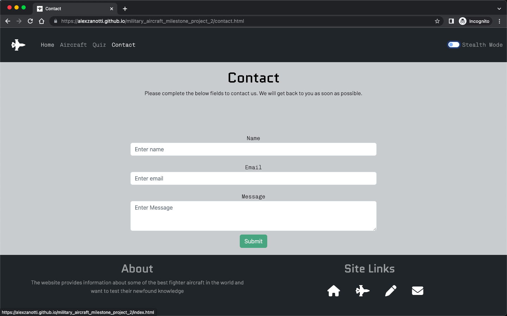

# Testing

## Testing Summary

Testing carried out in this project has been seperated into manual and automated testing. 

A brief description of Test Driven Development has also been included (this wasn't used in the development of this project however)

### Test Driven Development (TDD) 

Test-driven development (TDD) is a process of developing software by relying on requirements being converted into test cases, in which they are then developed to pass the test case.

This is opposed to the where development is completed and then tested after development to ensure that the code functions.

The TDD cycle is Red, Green, Refactor. The following sections explain each step:

#### Red
The purpose of this phase is to think about what you want to develop and write a test that informs the implementation of a feature. The test will only pass when the its expectations are met. As the code hasn't yet been developed, the test will fail, this the name of the phase being called "Red".

#### Green
The green phase is where you think about how to make your tests pass and implement code to get the test to pass. The goal is to find a solution, without worrying about optimizing your implementation (this comes in the next phase).

#### Refactor
In the refactor phase, you can begin thinking about how to improve your existing implementation. For example, you can think about how to accomplish the same output with more descriptive or faster code.

### Manual Testing

Manual testing has been seperated into 5 sub-categories:
* User Story Validation
* Functionality/Usability 
* Responsiveness
* Browser testing
* Lighthouse Report

#### User Story Validation
The first type of testing completed is around validating that the user stories are met by the website. Against each user story, evidence has been provided to ensure that the user stories are validated.

#### Functionality/Interactvity 
Manual testing is the next section of testing, which ensures that the website functions correctly and all of the interactvity that has been built into the website is functioning correctly.

#### Responsiveness
Responsiveness testing ensures that the responsive design of the website is working correctly.

#### Browser testing

Browser testing is the next type of testing - this ensures that the website functions in multiple browsers.

#### Lighthouse Report

Finally, the last type of test is running a Lighthouse Report for each page of the website.

### Automated Testing

Automated testing looks at validating that the code itself is free from errors.
#### validator.w3.org
This tests the HTML code 
#### jigsaw.w3.org/css-validator/
This tests the CSS code 
#### JSHint
This tests the Javascript code 

## Testing Procedure

The testing procedure looks at testing each user story/functionality/interactivity etc. to ensure that what has been designed matches what has been built. To evidence the testing, screenshots have been provided.

### Manual Testing

#### User Story Validation

##### As a Military Aircraft Enthusiast, I want to see images of the best fighter aircraft in the world.
- Images are provided of each of the fighter aircraft on the "Home" page. The user are previous and next buttons to toggle between each image: 

- Images are provided on the "Aircraft" page for each aircraft that is selected:

##### As a Military Aircraft Enthusiast, I want to learn more about where the best fighter aircraft in the world are located.
- A Google Maps API is located on the "Home" page, which has markers set for each country that operates at least one of the six fighter aircraft within the site:

##### As a user interested in learning more about fighter aircraft, I want to have an understanding of the performance of the fighter aircraft, such as the top speed, maxiumum altitude etc.
- For each buttons within the "Aircraft" page, there is a description and list of facts/figures for each fighter aircraft:

##### As a user interested in learning more about fighter aircraft, I want to be able to contact the websites "admin" team, in order to ask any further questions
- There is a "Contact" page within the website, where the user is able to get in contact with the "admin" team, should they have any further questions:

##### As a user who wants to test their military aircraft knowledge, I want to be able to test my newfound knowledge of the fighter aircraft
- On the "Quiz" page of the website, there are 12 questions that the user is able to answer, derived from information on the "Aircraft" page:

##### As a user who wants to test their military aircraft knowledge, I want to be able to receive feedback on how well i understand the information about the aircraft
- On the "Quiz" page of the website, the user is able to select the "submit" button, which will give them feedback on their score, to get an idea of how well they understand the content:

#### Functionality & Interactivity 

The following screenshots demonstrate functionality (usability) and interactivity of the website:

##### Header

* Hovering over the fighter icon changes the color to green (and takes you to the "Home" page correctly)

* Hovering over each navigation item works correctly in changing the color to a lighter shade of grey

* Clicking each navigation item then takes you to the relevant page correctly (and will be a white color to denote that you're on this page)

* The Stealth Mode toggle allows you to switch between the standard color scheme to a black and green color screen for the majority of the page content
* 
* 
* 
* 

##### Footer

* Hovering over the site link icons change color to green (and clicking on a site link will redirect you to the relevant page)

### Browser Testing

#### Chrome
* The Quiz page of the website is working correctly in Google Chrome

#### Firefox
* The Quiz page of the website is working correctly in Firefox

#### Edge
* The Quiz Members page of the website is working correctly in Edge

#### Safari
* The Quiz page of the website is working correctly in Safari

### Lighthouse Report

#### Home Page
* The Home page returned high scores in all areas of the lighthouse report, with the exception of the performance

#### Aircraft Page
* The Aircraft page returned high scores in the accessibility field of the lighthouse report, with the exception of the performance,best practice & SEO

#### Quiz Page
* The Quiz Members page returned high scores in the accessibility field of the lighthouse report, with the exception of the performance,best practice & SEO

#### Contact Page
* The Contact page returned high scores in the accessibility & best practice fields of the lighthouse report, with the exception of the performance & SEO

### Automated Testing

#### validator.w3.org (HTML)
##### index.html
* The index.html file contains no errors when put through a code validator

##### aircraft.html
* The aircraft.html file contains no errors when put through a code validator, however there are a number of warning due to empty headings (Javascript pulls through the HTML content)

##### quiz.html
* The quiz.html file contains a number of errors when first put through the validator

* The code was corrected and re-tested (only an empty header - Javascript pulls through HTML content)

##### contact.html
* The contact.html file contains a number of errors when first put through the validator

* The code was corrected and re-tested - only the Javascript type fields remained as a warning (deferring on emailJS installation documentation)

#### jigsaw.w3.org/css-validator (CSS)
##### style.css
* The style.css file contains no errors when put through a code validator

#### JSHint (Javascript)
##### main.js
* The main.js file contains a number of warnings

* The code was amended and retested

##### index.js
* The index.js file contains no errors when put through a code validator

##### aircraft.js
* The aircraft.js file contains no errors when put through a code validator

##### quiz.js
* The quiz.js file contains a single warning when initially put through the validator

* the quiz.js file was amended and retested

##### contact.js
* The contact.js file contains a number of warnings when initially put through the validator

* The contact.js file was amended and retested
